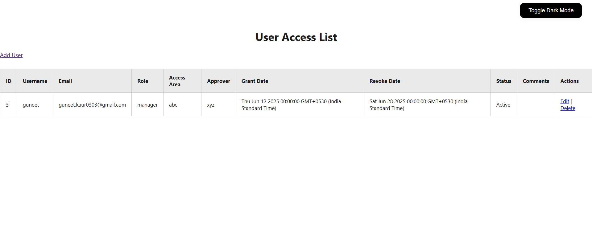
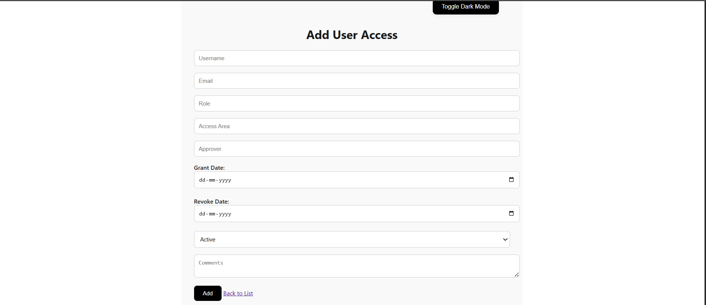
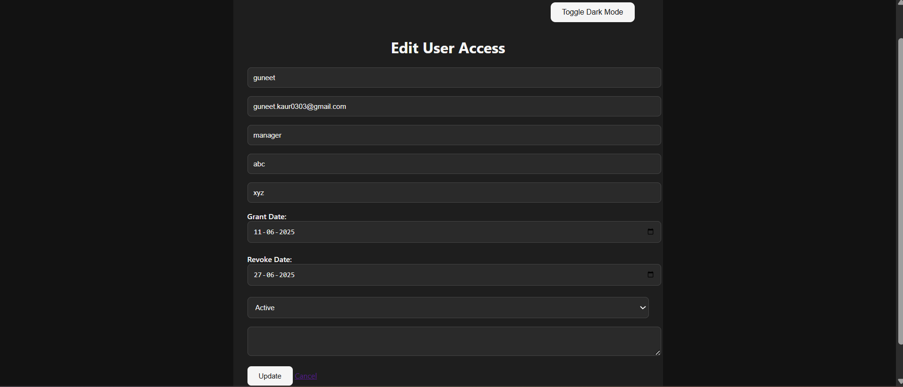

# IAM User Access Management Web App

This project is a **web-based application to manage user access permissions** within an organization. It allows admins to add, edit, view, and revoke user access records based on roles, access areas, and approvers. Built with Node.js, Express.js, MySQL, and EJS.

---

## 🚀 Features

- Add new user access records
- Edit/update access info
- Revoke or change status (Active/Revoked)
- Dark mode toggle for UI
- Responsive design using black & white theme
- Uses MySQL for data storage

---

## 🛠 Tech Stack

| Layer          | Technology                  |
|----------------|-----------------------------|
| Frontend       | HTML, CSS, JavaScript, EJS  |
| Backend        | Node.js, Express.js         |
| Database       | MySQL (XAMPP or PlanetScale)|
| Package Manager| npm                         |

---

## 🖥️ Screenshots

> ## Project Preview

### Login Page

### Dashboard

### Edit access

---

## ⚙️ How to Run Locally

### ✅ Prerequisites

- [Node.js](https://nodejs.org/) installed
- [XAMPP](https://www.apachefriends.org/index.html) with MySQL running  
- `npm install` run in the project directory

### 📁 Folder Structure

